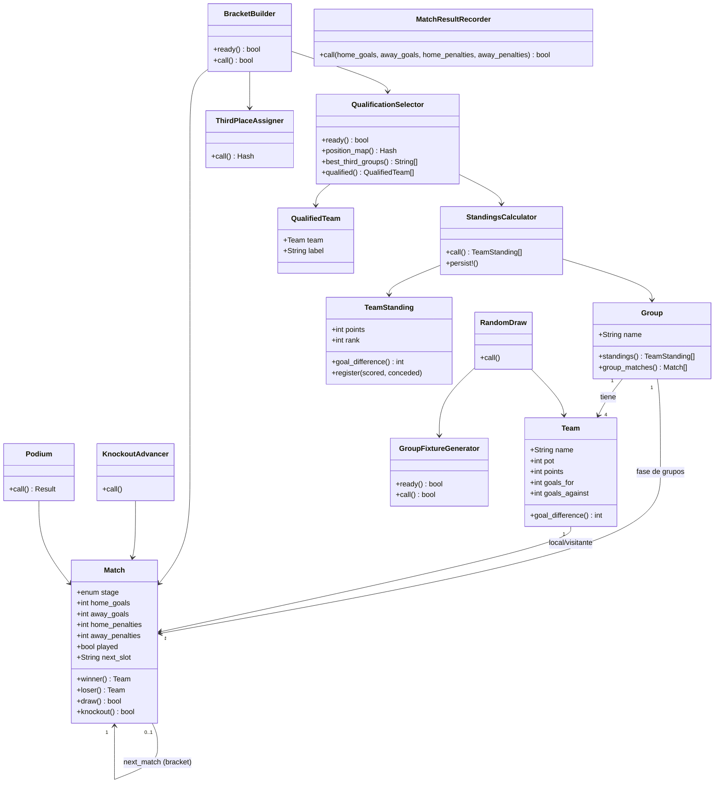

# Arquitectura lógica del sistema

## 1. Visión general

El sistema sigue una arquitectura **MVC** (la de Rails) reforzada con una **capa
de servicios** (objetos planos de Ruby, POROs) que concentra toda la lógica de
negocio del torneo. El objetivo es mantener **modelos y controladores delgados**
y cumplir con los principios **SOLID**.

```
Vistas (ERB + Tailwind)  <->  Controladores (delgados)  <->  Servicios (POO)
                                                                   |
                                                          Modelos ActiveRecord
                                                          Group / Team / Match
                                                                   |
                                                              SQLite (BD)
```

## 2. Explicación del funcionamiento

### Sorteo de grupos
`Draw::RandomDraw` reparte las 48 selecciones en los 12 grupos respetando los
**4 bombos** (un equipo de cada bombo por grupo) y las **sedes** de los
anfitriones (México en A, Canadá en B, Estados Unidos en D). También puede
hacerse manualmente editando el grupo y el bombo de cada selección.

### Fase de grupos
1. Cada `Group` (A a L) contiene 4 `Team`. `Schedule::GroupFixtureGenerator`
   crea los 6 partidos de "todos contra todos" del grupo (cada equipo juega 3).
2. Al registrar un resultado, `MatchResult::Recorder`:
   - valida los datos del partido,
   - guarda el `Match`,
   - invoca `Standings::Calculator` para recalcular puntos, goles y diferencia
     de cada equipo del grupo (victoria = 3, empate = 1, derrota = 0),
   - intenta construir el bracket con `Knockout::BracketBuilder` (solo procede
     cuando la fase de grupos está completa).
3. La **tabla de posiciones** se ordena por: **puntos, diferencia de goles,
   goles a favor y nombre** (criterio estable).

### Clasificación a eliminación directa
`Qualification::Selector` determina los **32 clasificados**:
- 1° y 2° lugar de cada grupo (24),
- los **8 mejores terceros** (comparando los 12 terceros por puntos, diferencia
  y goles a favor).

Expone un **mapa de posiciones** (`"1A"`, `"2C"`, `"3F"` a equipo) y la lista de
grupos cuyos terceros clasifican.

### Fase de eliminación directa
`Knockout::BracketBuilder` reproduce el **cuadro oficial del Mundial 2026**
(partidos 73 al 104): cada ranura de los dieciseisavos se llena por posición de
grupo (ej. `1C vs 2F`) y los 8 terceros se ubican con
`Knockout::ThirdPlaceAssigner`, que resuelve un **emparejamiento bipartito**
(algoritmo de Kuhn) respetando los grupos admitidos por cada ranura según la
tabla oficial. Todos los partidos se enlazan con `next_match`/`next_slot` para
formar el árbol hasta la final.

Al registrar cada resultado, `Knockout::Advancer`:
- coloca al **ganador** en el partido de la ronda siguiente (avance automático);
- cuando se juegan ambas semifinales, alimenta el **partido por el tercer lugar**
  con los perdedores.

Si hay empate en eliminación directa, el `Recorder` exige **penales** que
definan un ganador (no se permite empate).

`Knockout::Podium` reporta **campeón, subcampeón y tercer lugar**.

## 3. Principios SOLID aplicados

| Principio | Aplicación |
|-----------|------------|
| **S** - Responsabilidad única | Cada servicio hace una sola cosa: `Calculator` calcula posiciones, `Selector` selecciona clasificados, `Advancer` avanza ganadores, etc. Los modelos solo modelan datos. |
| **O** - Abierto/Cerrado | Las reglas (criterios de desempate, número de mejores terceros, estructura del cuadro) están encapsuladas; se pueden extender sin modificar controladores ni modelos. |
| **L** - Sustitución de Liskov | `TeamStanding` y `QualifiedTeam` son objetos de valor consistentes usados de forma intercambiable donde se esperan sus interfaces. |
| **I** - Segregación de interfaces | Servicios pequeños y enfocados (`Podium`, `GroupFixtureGenerator`) en lugar de una clase "Dios" del torneo. |
| **D** - Inversión de dependencias | Los controladores dependen de los servicios (abstracción de negocio), no de detalles de persistencia. Los servicios reciben sus colaboradores por constructor. |

## 4. Diagrama de clases



> El diagrama está en sintaxis **Mermaid**; se visualiza directamente en GitHub
> o en cualquier editor compatible (VS Code, etc.).

## 5. Modelo de datos (SQLite)

- **groups**: `name` (único).
- **teams**: `name`, `group_id`, `pot`, `points`, `goals_for`, `goals_against`.
- **matches**: `stage`, `group_id`, `home_team_id`, `away_team_id`,
  `home_goals`, `away_goals`, `home_penalties`, `away_penalties`, `played`,
  `slot`, `next_match_id`, `next_slot`.

La columna `next_match_id` (auto-referencia de `matches`) modela el **árbol del
bracket**: indica a qué partido y a qué lado (`next_slot` = "home"/"away") avanza
el ganador.
